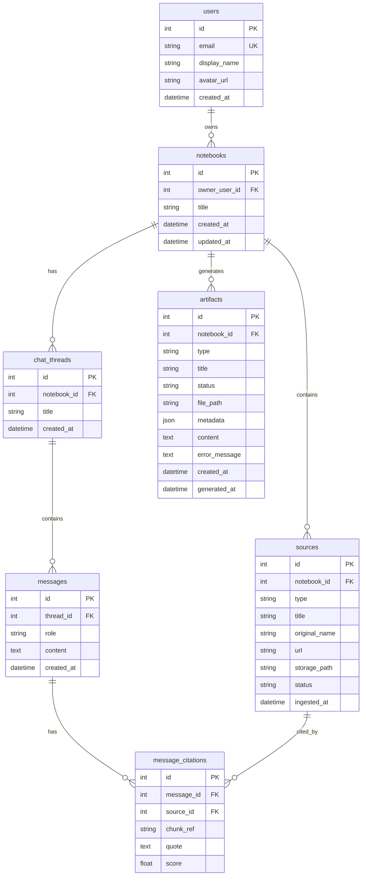

# ER Diagram

## Notes
- User isolation is enforced through ownership on `notebooks.owner_user_id`.
- Thread, source, citation, and artifact records are notebook-scoped.
- Artifact metadata is stored in JSON (`artifacts.metadata`).
