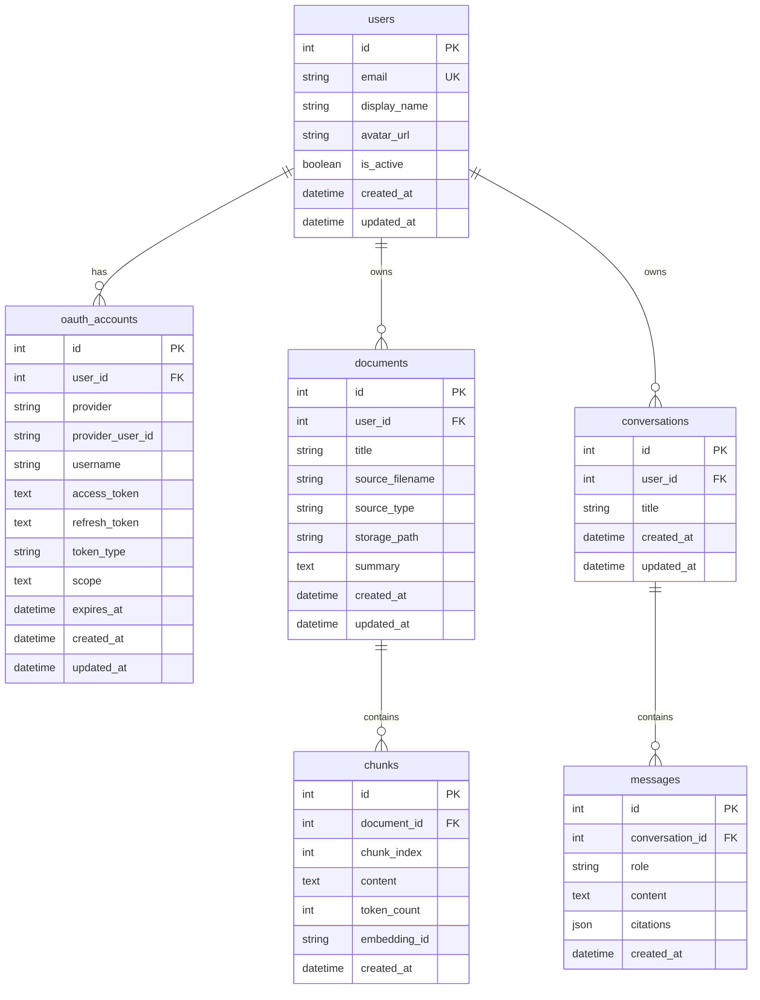

# ER Diagram

## Notes
- `oauth_accounts.provider` supports Hugging Face (`"huggingface"`).
- Composite unique constraints are documented in `DATABASE_SCHEMA.md`:
  - `uq_provider_user` on (`provider`, `provider_user_id`)
  - `uq_document_chunk_index` on (`document_id`, `chunk_index`)
